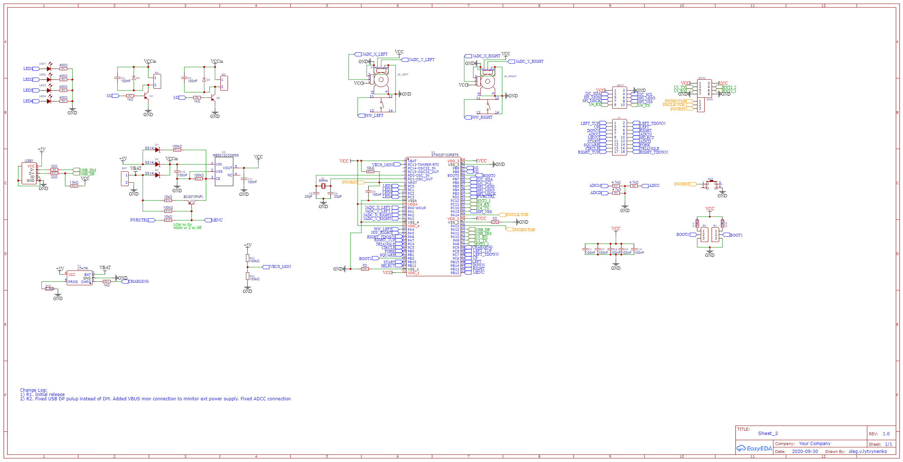

# diy.6axis_gamepad
Project for my own version of gamepad based on PS3 6axis gamepad controller hardware where main board has been replaced by custom PCB design with STM32 onboard. ESP32 is used as adapter to connect main board (stm32) to any external client app using USB, BLE, or custom RF adapter board. Communication with adapter board is possible by means of UART bus.

